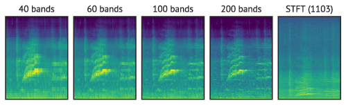
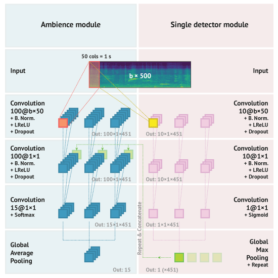
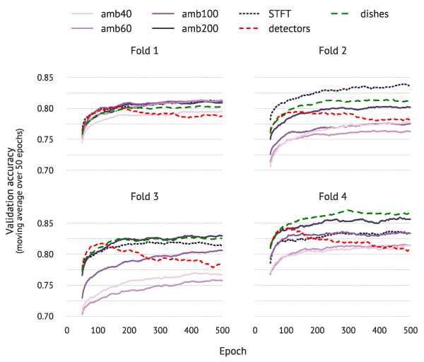
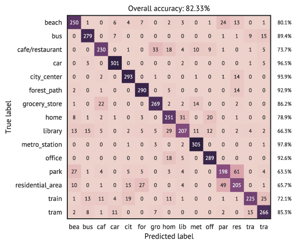
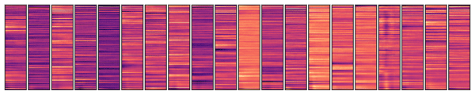

<a href="http://karol.piczak.com/papers/Piczak2017-DCASE.pdf"></a>
<a href="LICENSE"></a>

###### *Paper replication data for:*

## The details that matter: Frequency resolution of spectrograms in acoustic scene classification

> ###### Table of Contents
>
>  * [Overview](#overview)
>  * [Repository content](#repository-content)
>       * [Paper LaTeX source](#paper)
>       * [DCASE submission output](#submission)
>       * [Source code](#code)
>  * [Citing](#citing)
>  * [Poster](#poster)

### Overview

This work describes a submission to the [acoustic scene classification task](www.cs.tut.fi/sgn/arg/dcase2017/challenge/task-acoustic-scene-classification) of the [DCASE 2017 challenge](cs.tut.fi/sgn/arg/dcase2017/). The study is based on the following premises:

- The prevailing tendency of convolutional neural network models employed in audio classification tasks is to utilize spectrogram representations limited to 40-60 mel frequency bands. Higher values are rarely chosen despite the additional granularity they introduce:

    <p align="center"></p>
    
    Therefore, the main goal of this paper is to check **how using spectrograms with different frequency resolution could impact the accuracy in this task**.

- Most acoustic scenes can be described as a combination of a recurring background (ambient noise) mixed with distinct foreground elements (sound events). Still, [Mafra et al. **(2016)**](https://www.cs.tut.fi/sgn/arg/dcase2016/documents/workshop/SenaMafra-DCASE2016workshop.pdf) have shown that even a single averaged frame can have a good predictive capacity in acoustic scene classification tasks, it is thus likely that a good model should not be overly complicated. **Could both these assumptions be introduced a priori into the architecture of the employed network?**

###### Model structure

To this end, the proposed system has a simple design coming in two flavors - ambient only or extended with sound event detectors that signal if a template match has occurred anywhere in the whole recording.

<p align="center"></p>

The ambience processing model is evaluated with different frequency resolutions (`amb*` and `STFT`) and compared with models extended with 15 detector modules trained from scratch (`detectors`) or with a single detector pre-trained on hand-annotated fragments of `cafe/restaurant` recordings with sounds invovling cups, plates, etc. (`dishes`).

###### Results

System        |   Fold 1      |   Fold 2      |   Fold 3      |   Fold 4      |   1—4   |   Final (test)
--------------|---------------|---------------|---------------|---------------|---------|----------------
`amb40`       |   79.4 (0.5)  |   77.7 (0.8)  | 76.7 (1.0)    |   81.4 (1.0)  |   78.8  |   —
`amb60`       |   81.3 (0.6)  |   76.3 (1.0)  | 75.8 (0.9)    |   81.5 (1.0)  |   78.7  |   **62.0**
`amb100`      |   81.1 (0.6)  |   77.5 (0.9)  | 80.6 (0.7)    |   83.4 (1.3)  |   80.7  |   **67.7**
`amb200`      |   80.9 (0.8)  |   80.2 (0.8)  | 83.0 (0.9)    |   85.6 (1.3)  |   82.4  |   **70.6**
`STFT`        |   81.1 (0.9)  |   83.6 (0.8)  | 81.4 (0.9)    |   83.4 (1.3)  |   82.4  |   —
`detectors`   |   78.7 (0.9)  |   78.1 (1.1)  | 78.6 (1.3)    |   80.8 (1.4)  |   79.1  |   —
`dishes`      |   80.3 (0.9)  |   81.4 (0.7)  | 82.6 (0.6)    |   86.6 (1.0)  |   82.7  |   **69.6**

> ###### Mean (standard deviation) of validation accuracies across 50 final epochs of training on the development set and official evaluation results for submitted models. Values in percentages.

<p align="center"></p>

Results obtained in the experiments indicate that **increasing the number of mel frequency bands improves accuracy of the ambience model**. The `detectors` variant unfortunately shows signs of significant overfitting combined with higher training times. This effect is constrained in the `dishes` model when the detector array is limited to fine-tuning on one pre-trained module.

<p align="center"></p>

> ###### Confusion matrix of the thresholded `amb200` model.

Visualization of filters in the first layer shows that the ambience network essentially learns to discriminate frequency patterns. It is therefore a plausible explanation why higher frequency resolution of input data could be beneficial for classification.

<p align="center"></p>

Further examination would be needed to extrapolate this claim to other datasets and architectures, but preliminary results show that **spectrogram resolution could be an important factor influencing the behavior of models in audio classification tasks**. Another interesting extension would be to validate the concept of individual detector pre-training with more abundant annotation data and see if incorporating a priori domain knowledge about the problem could enhance the capabilities of the model.

### Repository content

- ##### [`/Paper/`](/Paper)

    LaTeX source code for the paper.

- ##### [`/Submission/`](/Submission/)

    Actual submission package as delivered for [DCASE 2017](http://www.cs.tut.fi/sgn/arg/dcase2017/challenge/submission).

- ##### [`/Code`](/Code/)

    -   ###### `/Code/*.py`

        Source code for experiments.

        Run [`run_amb.py`](Code/run_amb.py) to train the ambience model:

        ```
        $ python run_amb.py -h

        usage: run_amb.py [-h] [-D DEVICE] [-b BANDS] [--all]

        optional arguments:
          -h, --help            show this help message and exit
          -D DEVICE, --device DEVICE
                                Theano device used for computations
          -b BANDS, --bands BANDS
                                Number of mel bands or `stft`
          --all                 Train on all folds (for final model testing)
        ```

        This will generate `run_{BANDS}_{FOLD}.*` files in the [`results/`](Code/results/) directory:

        - `run_{BANDS}_{FOLD}.h5` - saved weights (highest holdout score)
        - `run_{BANDS}_{FOLD}.last.h5` - saved weights (last epoch)
        - `run_{BANDS}_{FOLD}.npz` - training history
        - `run_{BANDS}_{FOLD}.txt` - generated predictions

        Settings used for training models in the paper:

        ```python
        BANDS in [40, 60, 100, 200, 'stft']
        ```

        The `--all` switch is used for training the final model (all training folds included).

        Issuing:

        ```shell
        $ python run_detectors.py
        ```

        will train a hybrid model (ambience module + 15 binary event detectors). [`run_dishes.py`](Code/run_dishes.py) is
        a streamlined version with only 1 binary detector pre-trained on typical `cafe/restaurant` sounds
        (kitchenware, cutlery, crockery etc.). Detector pre-training is done with [`train_clues.py`](Code/train_clues.py) based on [`clues.txt`](Code/clues.txt) annotations.

    - ###### [`/Code/arf/`](/Code/arf/)

        Helper/backend code for generating submissions.

    - ###### [`/Code/Figures.ipynb`](/Code/Figures.ipynb) & [`/Code/figures/`](/Code/figures/)

        Raw figures with code used for visualization available as a Jupyter notebook ([`Figures.ipynb`](Code/Figures.ipynb)).

    - ###### [`/Code/results/`](/Code/results/)

        Training outputs. The [`eval.py`](Code/eval.py) script creates cross-validation accuracy metrics, list of misclassifications
        and a confusion matrix for a given system:

        ```
        $ python eval.py run_200
        ```

        The `_th_0.5` suffixes denote models with prediction thresholding, so:

        ```
        $ python eval.py run_200_th_0.5
        ```

        will generate a corresponding confusion matrix [`Code/results/run_200_th_0.5.pdf`](Code/results/run_200_th_0.5.pdf).

    - ###### [`/Code/annotator/`](/Code/annotator/)

        A very unpolished modification of [CrowdCurio's audio-annotator](https://github.com/CrowdCurio/audio-annotator) JavaScript interface used for creating the `dishes` ([`clues.txt`](Code/clues.txt)) annotation list.

### Citing

If you find this paper useful in some way, you can cite it with the following BibTeX entry:

```bibtex
@inproceedings{piczak2017dcase,
    title={The details that matter: Frequency resolution of spectrograms in acoustic scene classification},
    author={Piczak, Karol J.},
    booktitle={Proceedings of the Detection and Classification of Acoustic Scenes and Events 2017 Workshop},
    year={2017},
    location={Munich, Germany}
}
```

> K. J. Piczak. **The details that matter: Frequency resolution of spectrograms in acoustic scene classification**. In *Proceedings of the Detection and Classification of Acoustic Scenes and Events 2017 Workshop*, Munich, Germany, 2017.

Author version of this paper: [The details that matter: Frequency resolution of spectrograms in acoustic scene classification](http://karol.piczak.com/papers/Piczak2017-DCASE.pdf).

### Poster

<p align="center">
    <a href="Poster/Piczak2017-DCASE-Poster.pdf"></a>
</p>
